# Godzilla-Suo5MemShell

Godzilla 插件: 一键注入 Suo5 内存马

目前支持的中间件和内存马类型

- Tomcat Filter/Servlet
- Spring Controller
- WebLogic Filter
- Jetty Filter
- Resin Filter
- JBoss/WildFly Filter

部分中间件的兼容性参考 GodzillaMemoryShellProject

```
Tomcat 5 - 10
Jetty 7 - 11.0.11
JBoss (WildFly) 8 - 27.0.0
Resin 3 - 4.0.66
WebLogic 10.3.6 - 14
```

支持一键删除注入的 Tomcat/Spring 内存马

**⚠️ 注意删除内存马的过程本身存在一定风险, 如果使用不当 (例如参数输入错误) 可能会对正常业务造成影响**

参考:

[https://github.com/zema1/suo5](https://github.com/zema1/suo5)

[https://github.com/BeichenDream/Godzilla](https://github.com/BeichenDream/Godzilla)

[https://github.com/BeichenDream/GodzillaMemoryShellProject](https://github.com/BeichenDream/GodzillaMemoryShellProject)

注意 Releases 中的 jar 不一定是最新的, 建议按照下面的说明自行手动编译

如果使用过程中出现问题欢迎提 issues

## Usage

内存马注入部分参考了 Godzilla 内置的 FilterShell 和 MemoryShell 插件


### 注入 Tomcat Filter 内存马

需要指定 urlPattern, 一般不建议设置为 `/*`

filterName 为可选项, 如果为空则使用 Godzilla 默认生成的随机名称

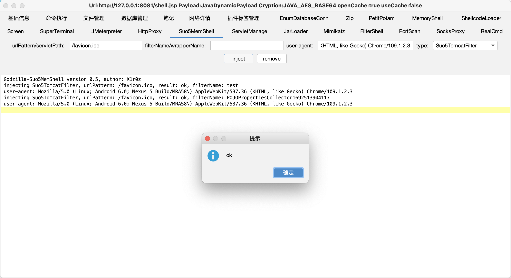

在 Godzilla 自带的 FilterShell 插件中可以看到注入的 Filter 内存马

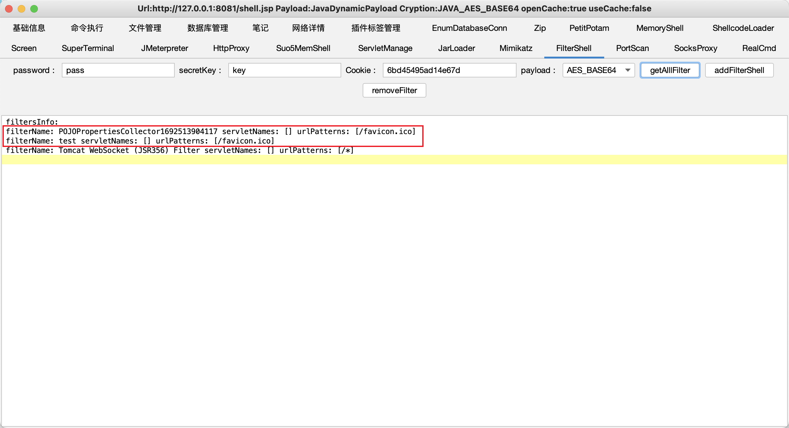

插件支持一键删除注入的 Filter 内存马

注意 urlPattern 和 filterName 要和之前设置的值对应

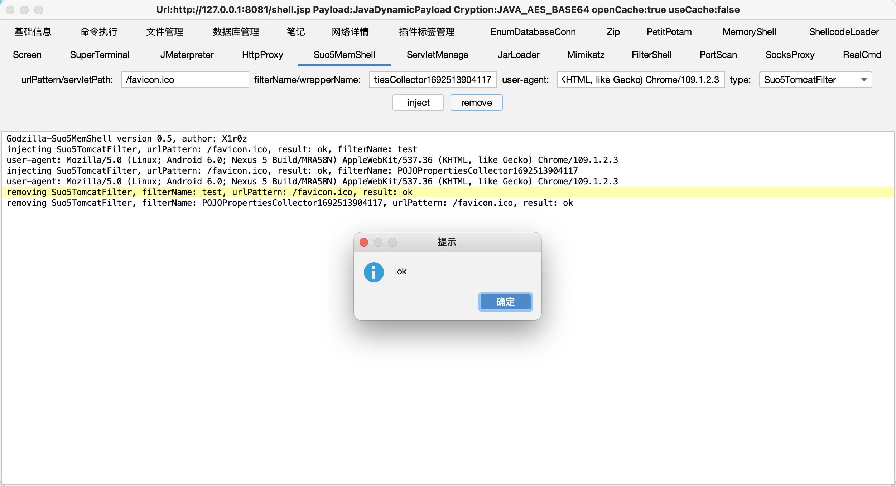

### 注入 Tomcat Servlet 内存马

需要指定 urlPattern

wrapperName 为可选项, 如果为空则使用 Godzilla 默认生成的随机名称

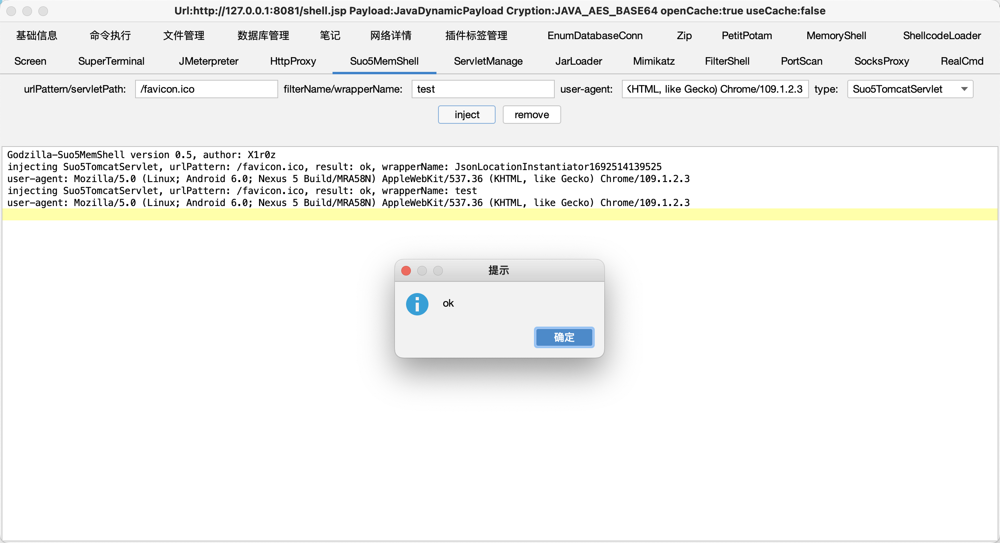

在 Godzilla 自带的 ServletManage 插件中可以看到注入的 Servlet 内存马

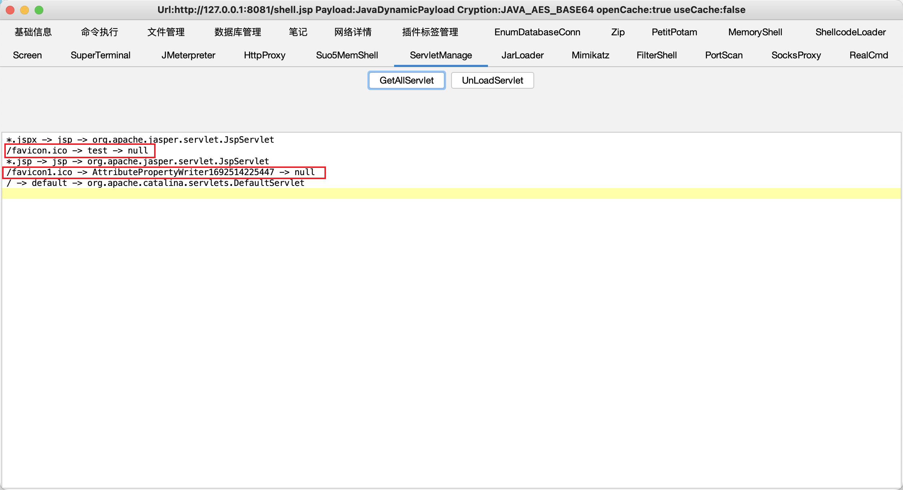

插件支持一键删除注入的 Servlet 内存马

注意 urlPattern 和 wrapperName 要和之前设置的值对应

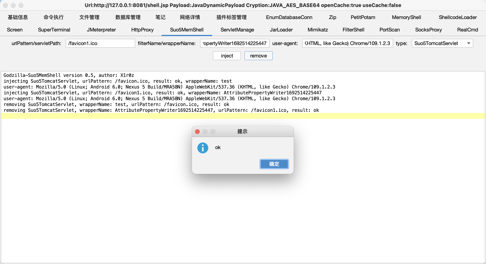

## 注入 Spring Controller 内存马

仅支持基于 Servlet API 的 Spring 应用

需要指定 urlPattern

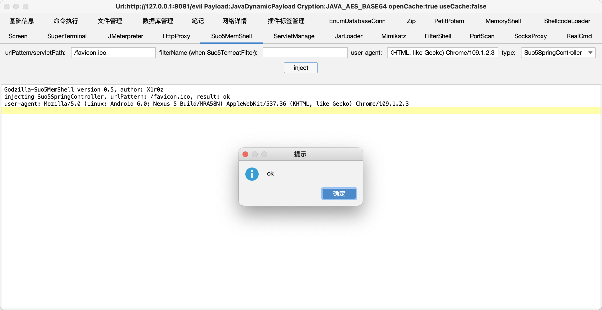

插件支持一键删除注入的 Spring Controller 内存马

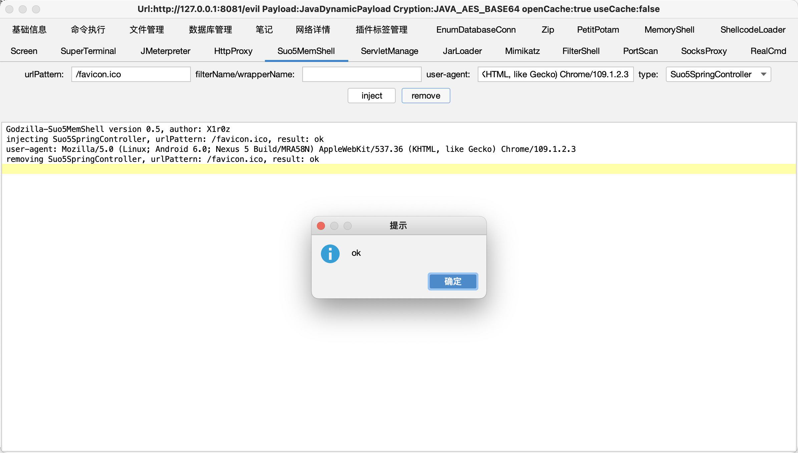

### 注入 WebLogic Filter 内存马

需要指定 urlPattern

目前不支持卸载 WebLogic Filter, 待解决

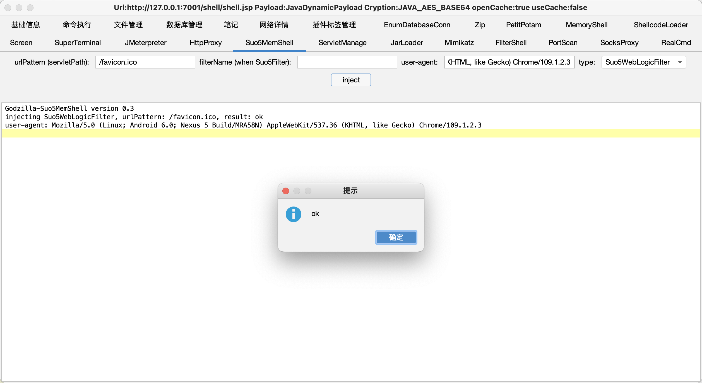

### 注入 Jetty Filter 内存马

需要指定 urlPattern

目前不支持卸载 Jetty Filter, 待解决

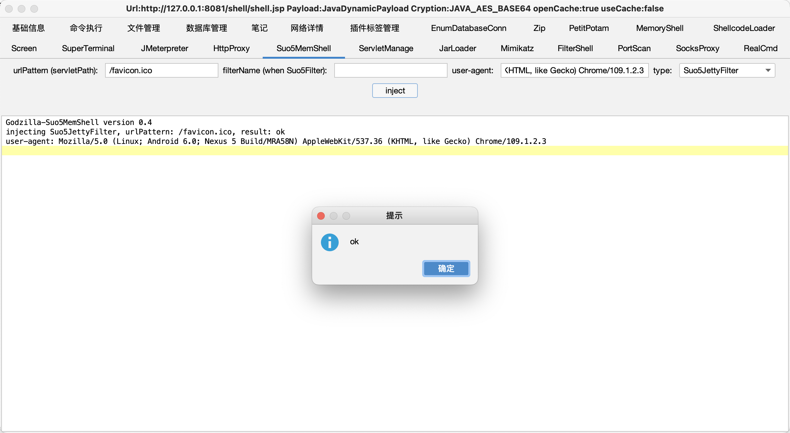

### 注入 Resin Filter 内存马

需要指定 urlPattern

目前不支持卸载 Resin Filter, 待解决

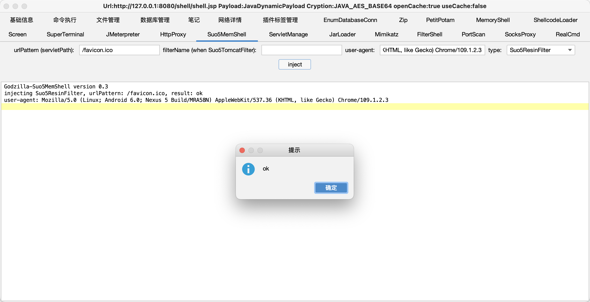

### 注入 JBoss/WildFly Filter 内存马

需要指定 urlPattern

目前不支持卸载 JBoss/WildFly Filter, 待解决

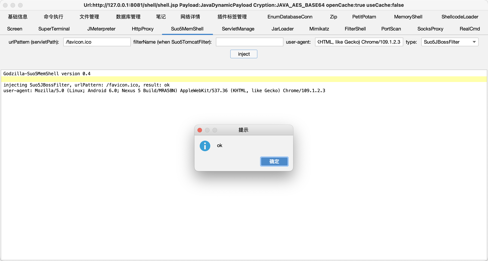

## Compile

GitHub Releases 页面提供了基于 JDK8 编译的 jar 包

当然你也可以选择自己手动编译

克隆本项目

```shell
git clone https://github.com/X1r0z/Godzilla-Suo5MemShell
```

修改 pom.xml 中 godzilla 依赖的 systemPath 为自己本地的路径

```xml
<dependency>
    <groupId>godzilla</groupId>
    <artifactId>godzilla</artifactId>
    <version>0.1.0</version>
    <scope>system</scope>
    <systemPath>/Users/exp10it/Downloads/godzilla.jar</systemPath>
</dependency>
```

在当前项目目录执行如下命令

```shell
mvn package -Dmaven.test.skip=true
```

生成的 jar 位于 `target` 目录

## Todo

- [x] 兼容更多中间件
- [ ] 支持卸载 Suo5 内存马
- [ ] 插件体验优化
- [ ] 想到了再写
