# Godzilla-Suo5MemShell

Godzilla 插件: 一键注入 Suo5 内存马

目前支持 Servlet/Filter 型内存马, 后续会添加其它中间件的支持

参考:

[https://github.com/zema1/suo5](https://github.com/zema1/suo5)

[https://github.com/BeichenDream/Godzilla](https://github.com/BeichenDream/Godzilla)

## Usage

Godzilla-Suo5MemShell 目前支持 Filter 和 Servlet 两种内存马

内存马注入部分参考了 Godzilla 内置的 FilterShell 和 MemoryShell 插件

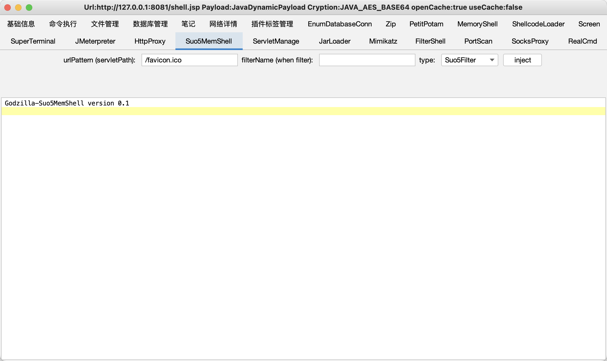

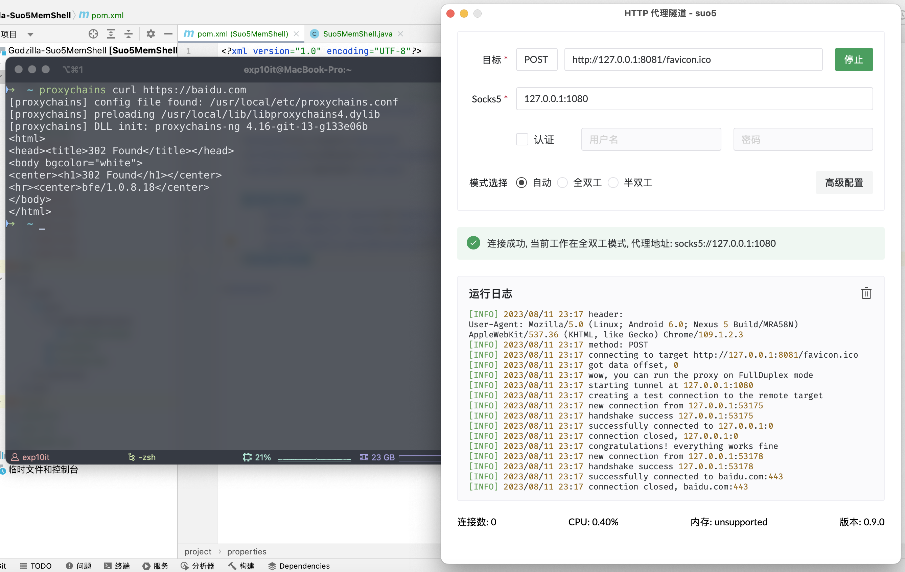

### 注入 Filter 内存马

需要指定 urlPattern, 一般不建议设置为 `/*`

filterName 为可选项, 如果为空则使用 Godzilla 默认生成的随机名称

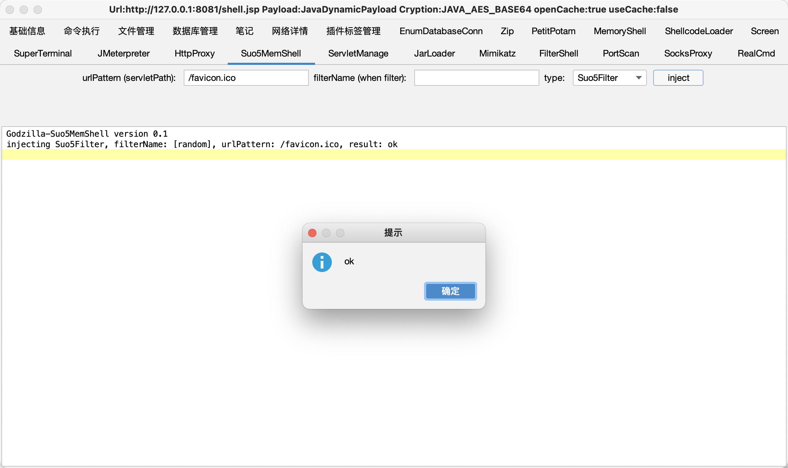

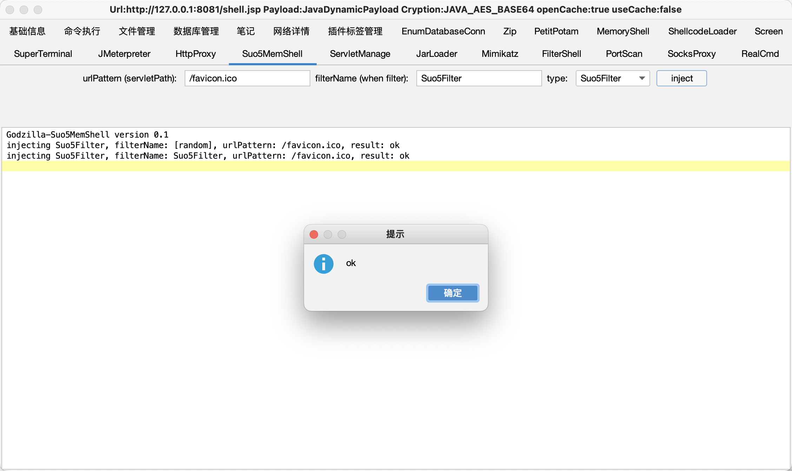

在 Godzilla 自带的 FilterShell 插件中可以看到注入的 Filter 内存马

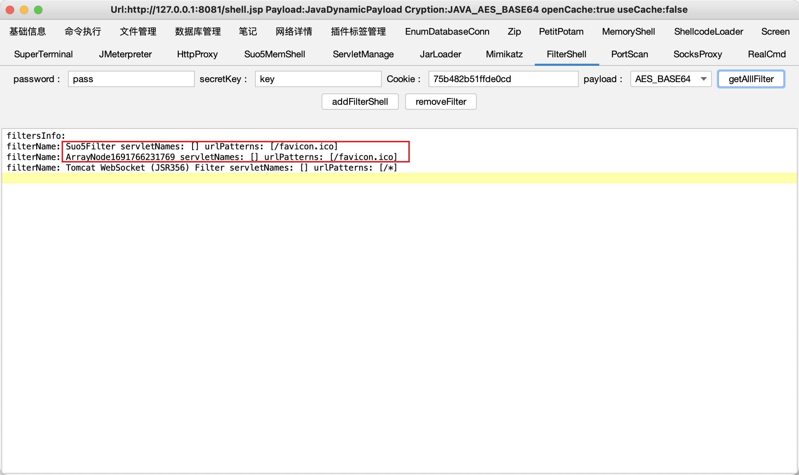

如果想要删除注入的 Suo5 内存马, 需要在 FilterShell 插件中操作

### 注入 Servlet 内存马

需要指定 urlPattern (servletPath), 注意该参数必须指定且不能与已有的 Servlet 名称冲突

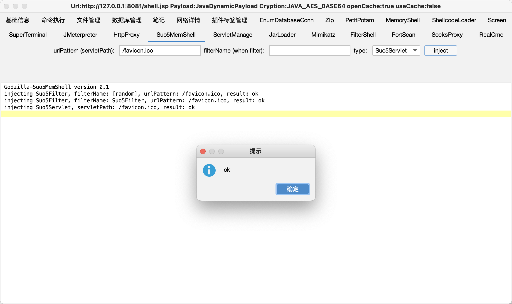

在 Godzilla 自带的 ServletManage 插件中可以看到注入的 Servlet 内存马

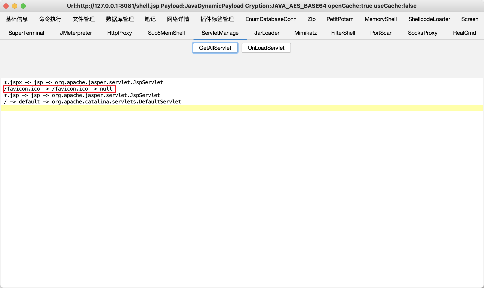

同样, 如果想要删除注入的 Suo5 内存马, 需要在 ServletManage 插件中操作

## Compile

GitHub Releases 页面提供了基于 JDK8 编译的 jar 包

当然你也可以选择自己手动编译

打开 IDEA 的项目结构, 点击 模块, 手动导入 godzilla.jar 和 Tomcat 依赖 (位于 Tomcat 路径的 `lib/` 目录)

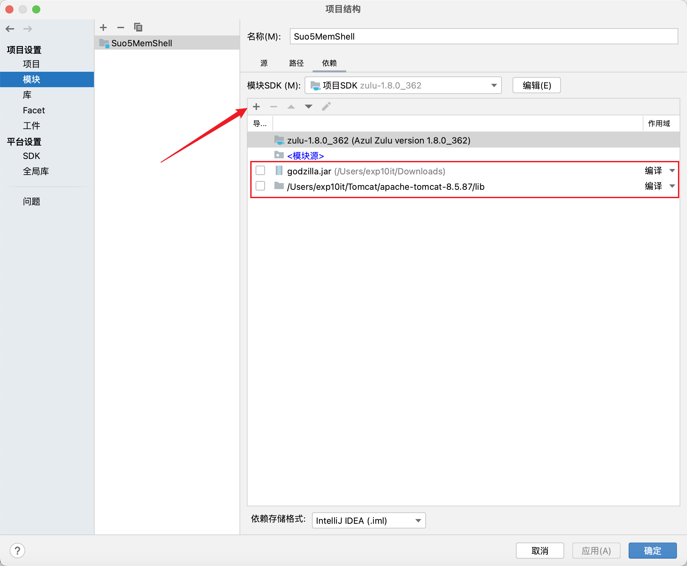

点击 工件, 依照图示添加 JAR

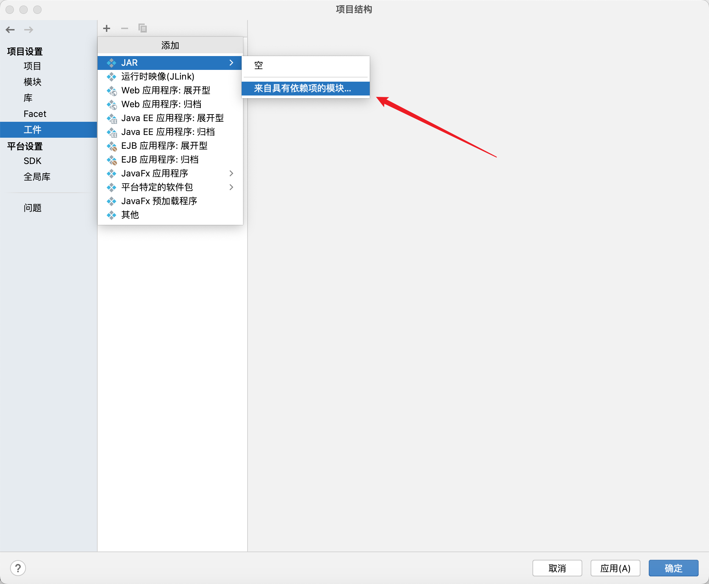

默认回车即可

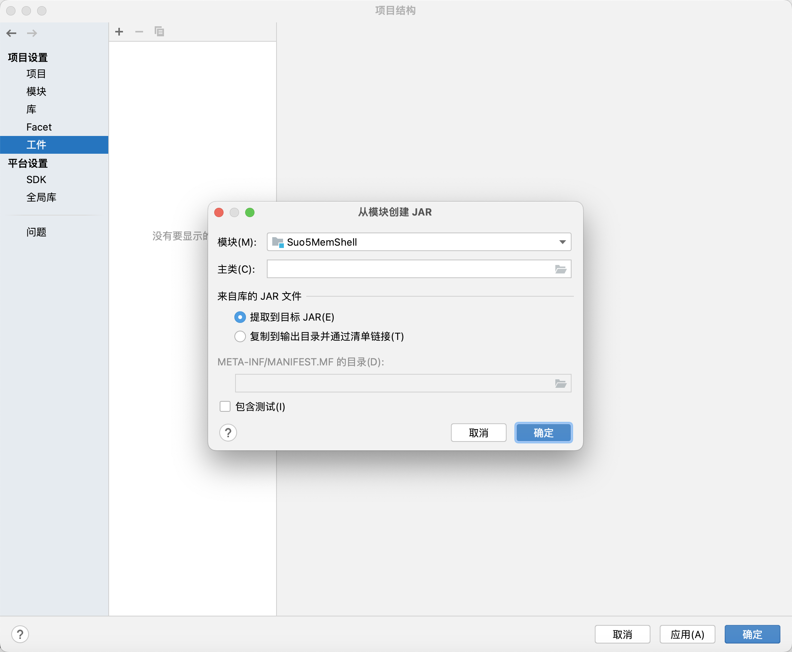

然后将输出布局中的以 "已提取" 开头的项全部删掉, 只留下 `Suo5MemShell 编译输出`

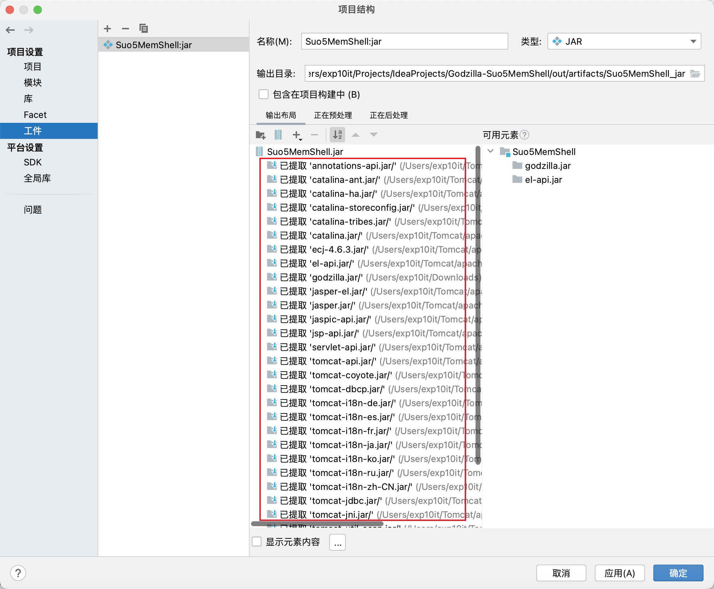

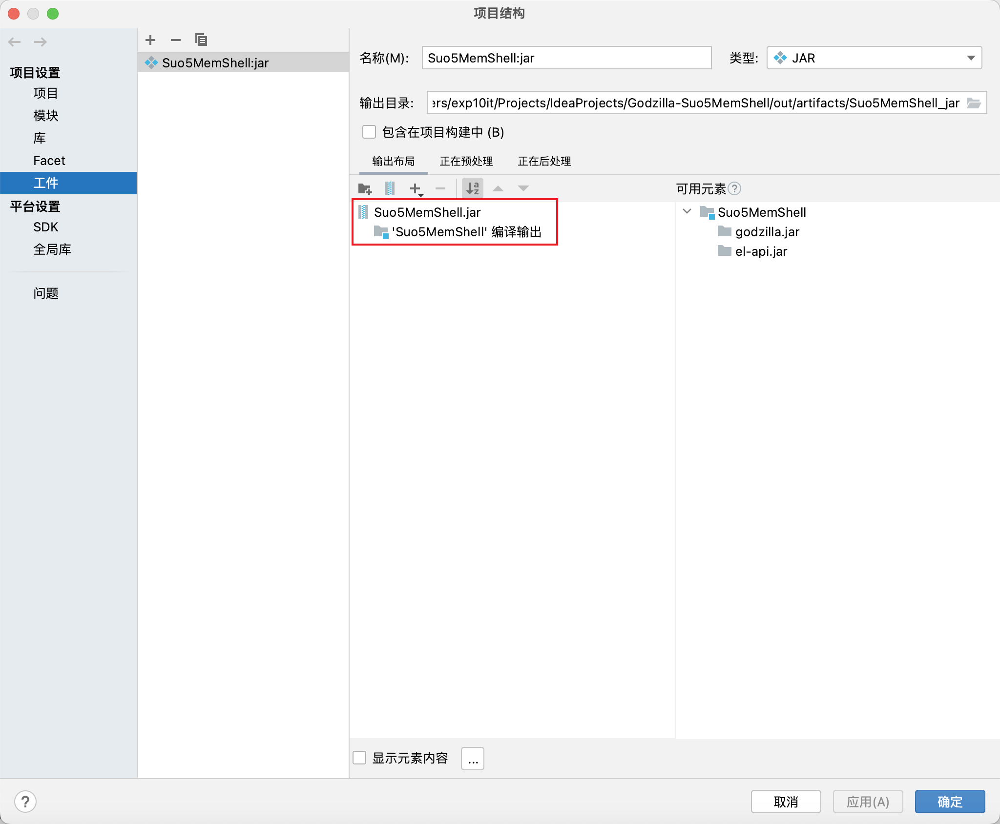

点击 构建 - 构建工件, 选择 `Suo5MemShell:jar` 并构建

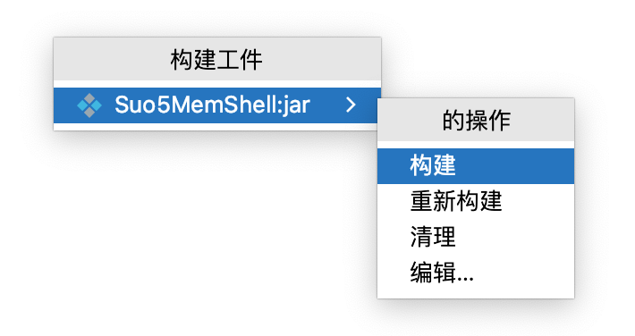

编译好的 jar 位于当前项目的 `out` 目录

## Todo

- [ ] 兼容更多中间件
- [ ] 想到了再写
